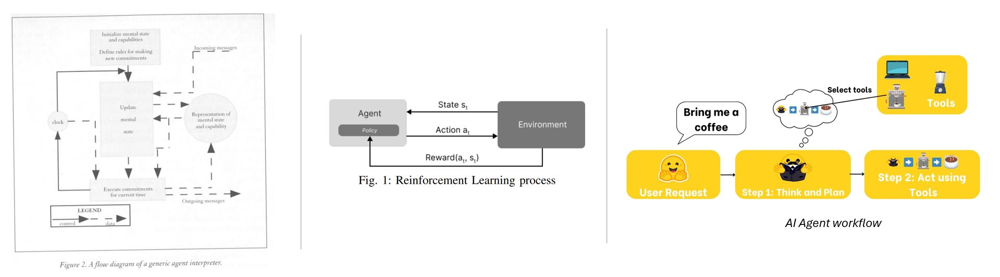

We’ve been hearing a lot about agents lately — articles and posts are overflowing with the term “Agentic AI” (and now, this one too 👀). But is it really something new? Back in the 1990s, people were already talking about agents and describing them as entities that operate continuously and autonomously within a dynamic and evolving environment. Others took a more philosophical approach, defining agents as entities whose internal state is represented by mental concepts such as beliefs, abilities, choices, and commitments. Their actions are constrained and governed by fixed rules.
{/* truncate */}
## Agents — Long Before Today

Reinforcement Learning introduced agents to the ability to learn by interacting with their environment and receiving feedback (either a reward or a penalty). Such agents can then learn continuously and generalize across a wide range of situations by performing more complex actions — especially when combined with neural networks (Deep Reinforcement Learning).

## The Era of LLMs

“AI Agents,” on the other hand, represent an evolution — or at least a different interpretation — of the agent concept. Here, decision-making is handled by a Large Language Model (LLM), whose power brings strong and broad reasoning capabilities. These agents no longer react to a physical environment, but rather to user input, which drives the course of their actions. The goal is no longer to learn how to perform a task, but simply to execute it efficiently. A user asks for the weather in Paris; the LLM infers that it needs to call an external tool, the agent sends a request to a weather API, observes the result, and returns it to the user.

So, the concept of an agent isn’t rigid — it’s a flexible approach that can adapt to various contexts and goals. In the case of LLMs, it allows them to interact with tools, making them even more powerful, as seen in the introduction of o3 and o4-mini, OpenAI’s latest agentic models.

Today it’s AI Agents — but what’s next?

## 📚 Sources

1. *An Overview of Agent-Oriented Programming* — Y. Shoham, *Software Agents*, 1997  
2. *The Landscape of Emerging AI Agent Architectures for Reasoning, Planning, and Tool Calling: A Survey* — Tula Masterman, 2024  
3. *Modelling Social Action for AI Agents* — Cristiano Castelfranchi, 1998  
4. *Deep Reinforcement Learning: An Overview* — Yuxi Li, 2018  
5. *Towards an Unsupervised Reward Function for a Deep Reinforcement Learning Based Intrusion Detection System* — Bilel Saghrouchni et al., 2024  
6. [Hugging Face Agents Course](https://huggingface.co/learn/agents-course/)
